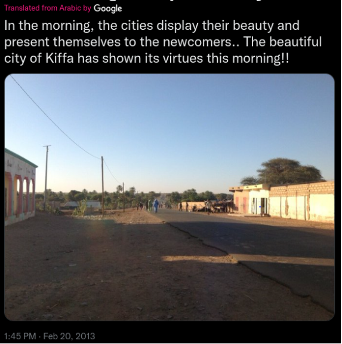

# OSINT Exercise #001

Hi, throughout this repository you'll find information on **Open Source Intelligence Gathering** that I hope can provide anyone with assistance to better their skills. I have the intention on publishing these on Medium, so be on the lookout for that.

# Useful Links
[OSINT Analysis & Practice](https://gralhix.com/)

# Tools Used

- [Google Earth](https://earth.google.com/web/@0,0,0a,22251752.77375655d,35y,0h,0t,0r/data=OgMKATA)
- [Wikipedia](https://www.wikipedia.org/)

# Problem
**Welcome to OSINT Exercise #001!**

**Task briefing:**  
Below you can see a screenshot from a tweet containing a photo. It contains all the relevant information necessary to help you find the exact location.  
Please identify the coordinates of where the photo was taken.  
  
Click  [here](https://gralhix.files.wordpress.com/2023/08/osint-exercise-001-big-picture.jpeg)  for the photo without the Twitter border.

**Exercise level:**  
For beginners: Hard  
For experts: Medium

# Solution + Thought Process

1. We are given a tweet that provides information on where the photo is taken. This is enough for us to start! Let's find out more about Kiffa...

2. Google is our friend. A quick search of 'Kiffa country' on Google leads us to a Wiki page that gives us tons of interesting information about the country. One particular thing we are interested in is the coordinates provided...

3. Coordinates allow us to make use of a powerful tool used across many industries... Google Earth. Providing the app with Kiffa's coordinates takes us across the globe to an aerial view of the country in interest.

4. In problems like these, landmarks are a huge help when we have little to no information provided in the photo. A landmark can range from a physical building down to a few trees. In this exercise, we'll make use of the trees and light poles from the photo to give us a start on where to look. 

5. After scanning the city, you'll see that there is only one section that leads out into a group of trees as seen in the photo... Let's zoom in there. 

6. Luckily, on the first try this seems to be our location in the photo! Referencing the labeled photos with the tweet provided, we are able to match up specific landmarks that allow us to conclude that we have found the correct area

# Takeaways

Some takeaways from this exercise is that Google Earth is a very powerful tool. It is amazing to live in a day where these things are so easily accessible. Being resourceful in using landmarks to help assist in finding important information is a necessary skill.

